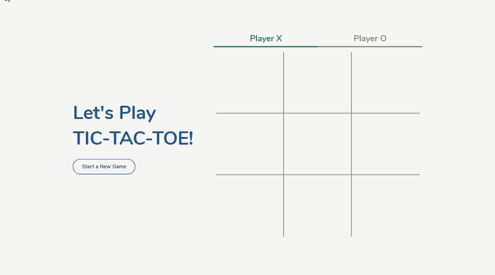

# Simple TIC-TAC-TOE Game

This is a fully responsive simple tic-tac-toe game written in HTML, CSS, and JavaScript.

**LIVE DEMO** - [tic-tac-toe.davidefrim.app](https://tic-tac-toe-davidefrim.vercel.app/)

    
    
    
    

    

## Acknowledgments

- [CleverProgrammer]() for their [Tic, Tac, Toe Game tutorial](https://www.youtube.com/watch?v=VjjZ2MaX0Ts)
